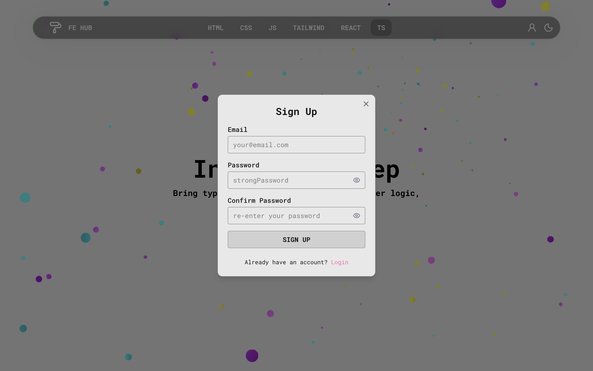

# Frontend Interview Hub

A personal project that serves as a **knowledge hub for React and frontend interview preparation**.  
It contains a curated collection of **questions and answers**, organized by topics, to help developers get ready for technical interviews.

## Table of Contents

- [About](#about)
- [Features](#features)
- [Technologies](#technologies)
- [Demo](#demo)
- [Contact](#contact)

## About

**Frontend Interview Hub** is an interactive platform I built to organize and practice **frontend interview questions**.  
It’s designed as both a **learning tool** and a **self-testing app**, wrapped as a **Progressive Web App (PWA)** so it can be installed directly on your desktop or mobile for quick access.

On the site, you can:

- **Browse by category** (JavaScript, CSS, React, etc.)
- **Filter questions** inside each category either by **knowledge level** (Beginner, Mid, Senior) or by **specific topics**
- **Explore all questions at once** without categories
- **Switch between two study modes**:
  - _Quiz mode_ (only the question is visible, answer appears on click)
  - _Learning mode_ (questions and answers open together)

There’s also a **favourites system**:

- Mark questions as favourites 💚
- Access them later in a dedicated **Favourites tab**
- Requires a simple **registration/login** to save your personalized list

This project combines **structured interview preparation** with **practical React development**, giving me a space to improve my coding skills while building something useful for other developers.

## Features

- **Comprehensive question bank** across multiple categories:
  - **HTML**
  - **CSS**
  - **JavaScript**
  - **Tailwind**
  - **React**
  - **TypeScript**
  - **Favourites** (your saved questions)

- **Flexible filtering**:

  - By **knowledge level** (Beginner, Mid, Senior)
  - By **topic** inside each category

- **Two study modes**:

  - _Quiz mode_ — only question is shown, answer revealed on click
  - _Learning mode_ — question and answer visible together

  

- **Favourites system**:

  - Save questions you like 💚
  - Access them later in a dedicated tab
  - Requires quick **registration/login**

- **User settings**:

  - Change password
  - Log out
  - Delete account

- **Feedback button** — send me your thoughts or suggestions directly

- **Light and dark themes** — switch seamlessly between modes

- **Fully responsive design** — smooth experience on both desktop and mobile

- **PWA support** — install the app on desktop or mobile for quick access

## Technologies

- **React (Next.js) + TypeScript**
- **Tailwind CSS** for styling
- **Notion** used as a lightweight **CMS** to store all questions and answers
- **Supabase** for authentication and storing user favorites
- **React Hook Form** + **Zod** for forms (registration & login)

- **Lucide-react** for icons
- **React Hot Toast** for notifications
- **React Syntax Highlighter** to render code snippets in answers
- **Radix UI** for modals and drawers
- **next-pwa** to provide full **PWA support**
- **Nodemailer** to handle feedback submission via email

- **Framer Motion** for animations
- **@react-three/fiber** and **OGL** for custom 3D and background effects

- UI inspiration and adapted components from **React Bits**, **Magic UI**, and **UI Layouts**

## Demo

You can try the live version of **Frontend Interview Hub** here:

[Live Demo](https://fe-interview-hub.vercel.app/)

## Contact

Feel free to reach out for any questions, suggestions, or opportunities!  
You can also find me here directly:

- **Email**: [marysmoly@gmail.com](mailto:marysmoly@gmail.com)
- **LinkedIn**: [linkedin.com/in/smllns](https://www.linkedin.com/in/smllns/)
- **GitHub**: [github.com/smllns](https://github.com/smllns)

I’m always happy to connect and collaborate.
